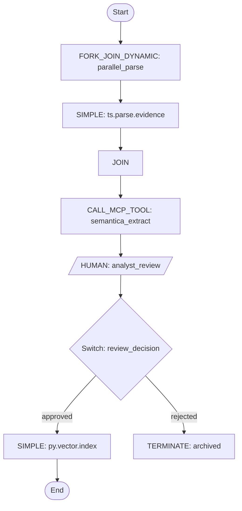

# Conductor — Dev Agent Skill

## Rules

- **Never use `python3 -c`** for any purpose — not to construct JSON, parse output, or post-process data.
  Write JSON to files using the Write tool or heredoc, then pass the file path to CLI commands.
- **Always attempt CLI installation before falling back** to the bundled `scripts/conductor_api.py`.
  Run `conductor --version` first. If missing, run `npm install -g @conductor-oss/conductor-cli` yourself.
- **CONDUCTOR GATE is active** until the first end-to-end ingest test passes.
  Do not merge Conductor workflow definitions into main before that gate lifts.
- **Semantica is authoritative** — call it via `CALL_MCP_TOOL`, never rewrite its logic in workflow tasks.
- **HUMAN task bridge (OQ-C5) is unresolved** — do not implement HUMAN → review_queue wiring without design approval.
- **No stubs** — every workflow definition must be executable, not placeholder.
- **Workers must be idempotent** — Conductor may redeliver tasks on failure or timeout.
- **Read the repo before theorizing** — check `GROUND_TRUTH.md` and `DECISION_REGISTER.md` before asserting architecture.

## First-Time Setup

### Step 1 — Install CLI

```bash
conductor --version
# If missing:
npm install -g @conductor-oss/conductor-cli
conductor --version
```

### Step 2 — Choose a Server

**Local dev (Docker)**:
```bash
docker run -p 8080:8080 conductoross/conductor:latest
# CLI auto-detects — no env var needed
conductor server status
```

**Full stack (with Postgres persistence)**:
```bash
git clone https://github.com/conductor-oss/conductor && cd conductor
docker compose -f docker/docker-compose.yaml up
```

**Remote server**:
```bash
export CONDUCTOR_SERVER_URL="http://your-server:8080/api"
```

**Orkes Developer Edition (free)**:
```bash
export CONDUCTOR_SERVER_URL="https://developer.orkescloud.com/api"
export CONDUCTOR_AUTH_KEY="<Key ID>"
export CONDUCTOR_AUTH_SECRET="<Key Secret>"
```

### Step 3 — Verify

```bash
conductor workflow list
```

If 401: set `CONDUCTOR_AUTH_KEY` and `CONDUCTOR_AUTH_SECRET`.

## Workflow Definitions

### Create

1. Write definition to file (never inline complex JSON):
```bash
cat << 'EOF' > workflow.json
{
  "name": "my_workflow",
  "description": "Description with input/output schema",
  "version": 1,
  "schemaVersion": 2,
  "tasks": [...],
  "outputParameters": {},
  "failureWorkflow": "error_handler",
  "restartable": true
}
EOF
```

2. Register:
```bash
conductor workflow create workflow.json
```

3. Verify workers — after registering, list SIMPLE task types and confirm each has a registered worker:
```bash
conductor taskDef list
```
For any SIMPLE task with no worker, inform the user and offer to scaffold one.

### Update / Delete

```bash
conductor workflow update workflow.json
conductor workflow delete {name} {version}
```

## Running Workflows

```bash
# Async (returns workflowId)
conductor workflow start -w {name} -i '{"key": "value"}'

# Sync (wait for completion)
conductor workflow start -w {name} -i '{"key": "value"}' --sync

# From file (large inputs)
conductor workflow start -w {name} -f input.json

# With version and correlation ID
conductor workflow start -w {name} --version {v} --correlation {id} -i '{"key":"value"}'
```

## Monitoring

```bash
# Status
conductor workflow status {workflowId}
conductor workflow get-execution {workflowId} -c

# Search
conductor workflow search -s RUNNING -c 20
conductor workflow search -w {name} -s FAILED -c 10
```

Statuses: `RUNNING` · `COMPLETED` · `FAILED` · `TIMED_OUT` · `TERMINATED` · `PAUSED`

## Managing Executions

```bash
conductor workflow pause {workflowId}
conductor workflow resume {workflowId}
conductor workflow terminate {workflowId}
conductor workflow restart {workflowId}
conductor workflow retry {workflowId}
conductor workflow skip-task {workflowId} {taskRefName}
conductor workflow jump {workflowId} {taskRefName}
```

## Signaling Tasks (HUMAN / WAIT)

```bash
conductor task signal \
  --workflow-id {workflowId} \
  --task-ref {taskRefName} \
  --status COMPLETED \
  --output '{"decision": "approved", "analyst": "matts"}'
```

Statuses: `COMPLETED` · `FAILED` · `FAILED_WITH_TERMINAL_ERROR`

## Task Types — Quick Reference

| Type | Use |
|------|-----|
| `SIMPLE` | Call registered worker via task queue |
| `HTTP` | Direct HTTP call — no worker needed |
| `INLINE` | JS expression evaluated inline |
| `SWITCH` | Conditional branching |
| `FORK_JOIN` | Static parallel branches |
| `FORK_JOIN_DYNAMIC` | Dynamic fan-out over a list |
| `DO_WHILE` | Loop until condition or cap |
| `SUB_WORKFLOW` | Execute another workflow inline |
| `WAIT` | Pause for time/signal/webhook |
| `HUMAN` | Pause for human approval — **OQ-C5 bridge unresolved** |
| `TERMINATE` | End with explicit status |
| `SET_VARIABLE` | Write to workflow-scoped variables |
| `JSON_JQ_TRANSFORM` | Transform output with jq |
| `LLM_CHAT_COMPLETE` | Call LLM provider (14+) |
| `LLM_TEXT_COMPLETE` | Non-chat LLM completion |
| `LIST_MCP_TOOLS` | Discover tools from MCP server |
| `CALL_MCP_TOOL` | Execute MCP tool |
| `LLM_GENERATE_EMBEDDINGS` | Generate vector embeddings |
| `LLM_INDEX_DOCUMENT` | Index into vector store |
| `LLM_SEARCH_INDEX` | Semantic similarity search |

## MCP_PLATFORM Worker Conventions

- Worker task type names: `{server}.{domain}.{action}` — e.g., `ts.parse.facebook`, `py.nlp.semantica_extract`
- All workers live inside MCP server containers and poll outbound
- Workers are stateless and idempotent
- Workflow definitions use `schemaVersion: 2`
- All production workflows define `failureWorkflow`

## AI Agent Pattern (DO_WHILE + LLM_CHAT_COMPLETE)

```json
{
  "type": "DO_WHILE",
  "name": "agent_loop",
  "loopCondition": "$.agent_loop['iteration'] < 5 && $.agent_loop['last_action'] != 'FINAL'",
  "loopOver": [
    {
      "type": "LLM_CHAT_COMPLETE",
      "name": "reason_step",
      "inputParameters": {
        "llmProvider": "litellm",
        "model": "${workflow.input.model}",
        "messages": [
          {"role": "system", "content": "You are a forensic analysis agent. Output strict JSON: {\"action\": \"TOOL\"|\"FINAL\", \"tool\": \"tool_name\"|null, \"input\": \"string\", \"answer\": \"string\"}"},
          {"role": "user", "content": "Query: ${workflow.input.query}\nIteration: ${agent_loop.output.iteration}\nLast result: ${agent_loop.output.last_tool_result}"}
        ]
      }
    },
    {
      "type": "SWITCH",
      "name": "route_action",
      "expression": "$.reason_step.output.action",
      "decisionCases": {
        "TOOL": [
          {
            "type": "CALL_MCP_TOOL",
            "name": "call_tool",
            "inputParameters": {
              "server": "py-mcp-server",
              "tool": "${reason_step.output.tool}",
              "input": "${reason_step.output.input}"
            }
          },
          {
            "type": "SET_VARIABLE",
            "name": "update_memory",
            "inputParameters": {
              "last_action": "TOOL",
              "last_tool_result": "${call_tool.output.result}"
            }
          }
        ]
      },
      "defaultCase": [
        {
          "type": "TERMINATE",
          "name": "final_answer",
          "inputParameters": {
            "terminationStatus": "COMPLETED",
            "workflowOutput": {"answer": "${reason_step.output.answer}"}
          }
        }
      ]
    }
  ]
}
```

## Workers (SDK Examples)

### Python Worker

```python
from conductor.client.automator.worker_task import worker_task
from conductor.client.worker.worker_interface import WorkerInterface
from conductor.client.http.models.task import Task
from conductor.client.http.models.task_result import TaskResult
from conductor.client.http.models.task_result_status import TaskResultStatus
from conductor.client.configuration.configuration import Configuration
from conductor.client.automator.task_handler import TaskHandler

@worker_task(task_definition_name='py.nlp.extract_entities')
def extract_entities(task: Task) -> TaskResult:
    """
    Worker for py.nlp.extract_entities — idempotent, stateless.
    Conductor may redeliver on failure or timeout.
    """
    text = task.input_data.get('text', '')
    # Call Semantica or NLP logic here — do not inline Semantica logic
    result = call_semantica(text)
    task_result = task.to_task_result(status=TaskResultStatus.COMPLETED)
    task_result.add_output_data('entities', result)
    return task_result

# Start polling
config = Configuration(server_api_url='http://conductor-server:8080/api')
with TaskHandler(workers=[extract_entities], configuration=config) as task_handler:
    task_handler.start_processes()
    task_handler.join_processes()
```

Install: `pip install conductor-python`

### TypeScript Worker

```typescript
import { ConductorClient, TaskRunner } from '@io-orkes/conductor-javascript';

const client = new ConductorClient({
  serverUrl: 'http://conductor-server:8080/api',
});

const worker = {
  taskDefName: 'ts.parse.facebook',
  // Workers must be idempotent — Conductor may redeliver on failure or timeout
  execute: async (task: Task) => {
    const filePath = task.inputData?.filePath;
    const result = await parseFacebookHtml(filePath);
    return {
      status: 'COMPLETED',
      outputData: { messages: result.messages, count: result.count },
    };
  },
};

const runner = new TaskRunner({
  client,
  worker,
  options: { pollInterval: 100, concurrency: 5 },
});

runner.startPolling();
```

Install: `npm install @io-orkes/conductor-javascript`

## Workflow Visualization (Mermaid)

When asked to visualize a workflow, generate a Mermaid flowchart:



Link to UI: `http://localhost:8080/workflowDef/{workflowName}` (strip `/api` from CONDUCTOR_SERVER_URL).

## Orkes Enterprise Features

Requires Orkes Conductor (cloud or private):

```bash
conductor schedule list/create/pause/resume/delete
conductor secret list/get/put/delete
conductor webhook list/create/update/delete
```

## MCP Server for AI Agents

Configure `conductor-mcp` to give AI agents direct Conductor access:

```json
{
  "mcpServers": {
    "conductor": {
      "command": "conductor-mcp",
      "args": ["--config", "<ABSOLUTE_PATH_TO_conductor-config.json>"]
    }
  }
}
```

Install: `pip install conductor-mcp`
Config: JSON file with `CONDUCTOR_SERVER_URL`, `CONDUCTOR_AUTH_KEY`, `CONDUCTOR_AUTH_SECRET`

## Troubleshooting

| Symptom | Cause | Fix |
|---------|-------|-----|
| CLI not found | npm not installed or PATH missing | `npm install -g @conductor-oss/conductor-cli` |
| Connection refused | Server not running or wrong URL | Check `CONDUCTOR_SERVER_URL`, run `conductor server status` |
| 401 Unauthorized | Auth required | Set `CONDUCTOR_AUTH_KEY` + `CONDUCTOR_AUTH_SECRET` |
| Workflow stuck | SIMPLE task with no registered worker | `conductor taskDef list` — confirm worker is polling |
| HUMAN task never advances | review_queue bridge not implemented (OQ-C5) | Signal manually: `conductor task signal ...` |

## Upgrade Skills

```bash
curl -sSL https://conductor-oss.github.io/conductor-skills/install.sh | bash -s -- --all --upgrade
```

## Key References

- Docs: https://conductor-oss.github.io/conductor/
- GitHub: https://github.com/conductor-oss/conductor
- Orkes Docs: https://orkes.io/content/
- MCP Server: https://github.com/conductor-oss/conductor-mcp
- Examples: https://github.com/conductor-sdk/conductor-examples
- MCP Workbench: https://github.com/conductor-oss/mcp-workbench
- Conductor AGENTS.md: https://github.com/conductor-oss/conductor/blob/main/AGENTS.md
- Wiki: `docs/wiki/skills/orchestration/conductor/`
